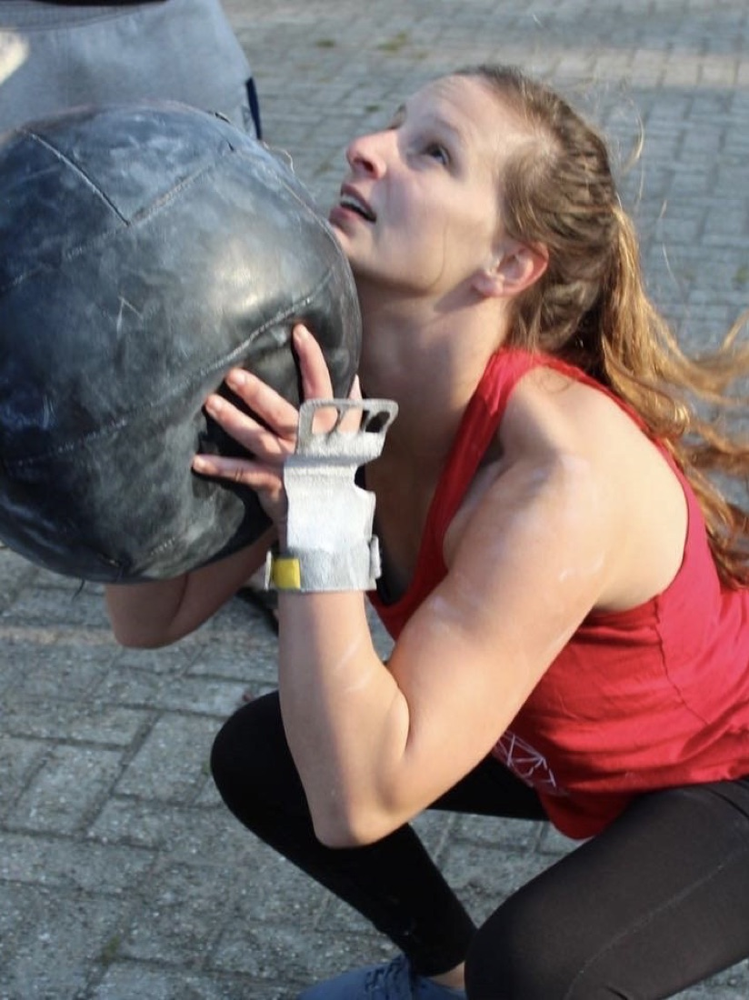

# Effort België — nieuwe website

Statische, **mobile-first** herbouw van effortbelgie.be in een dark cinematic / industrieel jasje
(charcoal/zwart + signal red `#FF2D2D`). Geen build-stap nodig — gewoon HTML, CSS en een beetje JS.

## Pagina's
| Bestand | Pagina |
|---|---|
| `index.html` | Home (hero-video, missie & visie, aanbod, prijzen, contact) |
| `team.html` | Team — 8 coaches |
| `aanbod.html` | Aanbod — groepslessen, open gym, PT + lestypes (WOD/OLY/HY*WOD/TEAM) |
| `prijzen.html` | Prijzen — 4 formules + voorwaarden |
| `get-started.html` | Proefles boeken — stappen + wat meebrengen |

## Lokaal bekijken
```bash
cd effortbelgie
python3 -m http.server 4174
# open http://localhost:4174
```

## Echte foto's toevoegen (aanbevolen)
De coach-foto's zijn nu nette placeholders met monogram + "Foto volgt". In `team.html` staat
per coach een `<!--  -->` regel klaar in `.photo-slot`. Vervang de placeholder, bv.:
```html
<div class="photo-slot"></div>
```
Sfeer/hero-beelden in `assets/img/` mag je ook vervangen door echte foto's van de box (zelfde
bestandsnamen aanhouden = klaar).

## Beeld & video
Alle sfeerbeelden zijn AI-gegenereerd (cinematic, geen herkenbare gezichten). De hero-video
`assets/video/hero.mp4` is een naadloze, geluidloze loop (576 KB). Posters: `hero-mobile.jpg` /
`hero-desktop.jpg`.

## Boekingen
Alle CTA-knoppen wijzen naar de bestaande WODapp-proefles:
`https://www.wodapp.nl/free-trial/p/40513`. Eén plek aanpassen = zoek-en-vervang die URL.

## SEO
`sitemap.xml`, `robots.txt`, per pagina meta + Open Graph (`assets/img/og.jpg`) en JSON-LD
(SportsActivityLocation) zijn aanwezig. Pas `https://effortbelgie.be/` aan als het domein wijzigt.

## Deployen
Sleep de map naar **Netlify Drop** of push naar GitHub + Netlify/Vercel. Geen config nodig
(pure statische site).
